# GrantAuditor Protocol Architecture

This document describes the technical architecture, state machines, and workflows of the GrantAuditor decentralized autonomous escrow and adjudication system on the GenLayer network.

## 1. System Workflow Diagram

The sequence diagram below illustrates the complete lifecycle of a grant milestone adjudication, from creation to final payout, arbitration, or decentralized appeal:

```mermaid
sequenceDiagram
    autonumber
    actor Funder
    actor Grantee
    participant Contract as GrantAuditor Contract
    participant GenVM as GenVM (Consensus AI)
    actor DAO as DAO Arbitration Panel
    actor Appellant as Appellant (Grantee / Funder)

    Funder->>Contract: create_grant (locks Escrow in GEN)
    Note over Contract: Status: PENDING
    Grantee->>Contract: submit_evidence (progress report + URL)
    Note over Contract: Status: SUBMITTED
    
    rect rgb(10, 20, 40)
        Note over Contract, GenVM: AI Consensus Adjudication
        Funder->>Contract: adjudicate_milestone
        Contract->>GenVM: run_nondet (leader_fn & validator_fn)
        GenVM->>GenVM: Render proposal & evidence URLs
        GenVM->>GenVM: Execute LLM verdict consensus with Canary Defense
        GenVM-->>Contract: Consensus output (RELEASE | PARTIAL | CUT | ESCALATE)
    end

    alt AI Verdict: RELEASE (100% Payout)
        Contract->>Grantee: emit_transfer (100% funds)
        Contract->>Contract: Update Reputations (+10 Grantee, +5 Funder)
        Note over Contract: Status: APPROVED
    else AI Verdict: PARTIAL (50/50 Split)
        Contract->>Grantee: emit_transfer (50% funds)
        Contract->>Funder: emit_transfer (50% refund)
        Contract->>Contract: Update Reputations (+5 Grantee, +5 Funder)
        Note over Contract: Status: PARTIAL
    else AI Verdict: CUT (100% Refund on 3rd attempt)
        Contract->>Funder: emit_transfer (100% refund)
        Contract->>Contract: Update Reputations (-15 Grantee)
        Note over Contract: Status: CUT
    else AI Verdict: ESCALATE (Failed Render / Disagreement)
        Note over Contract: Status: ESCALATED (Funds Preserved)
        
        opt Path A: DAO Authority Arbitration
            DAO->>Contract: resolve_escalated_milestone (Verdict + Reason)
            alt DAO Verdict
                DAO->>Grantee: emit_transfer (Appropriate payout)
                DAO->>Funder: emit_transfer (Appropriate refund)
            end
        end

        opt Path B: Stake-Based Appeal Protocol (Break Inactive Funder Deadlock)
            Appellant->>Contract: file_appeal (Lock Staked GEN Bond + Supplemental Proof)
            Note over Contract: Status: APPEALED
            Appellant->>Contract: adjudicate_appeal
            Contract->>GenVM: run_nondet (Senior AI Appellate Jury)
            GenVM-->>Contract: Appellate Verdict (OVERTURN | UPHOLD)
            alt Appellate Verdict: OVERTURN (Appeal Won)
                Contract->>Appellant: emit_transfer (100% Staked Bond Refund)
                Contract->>Grantee: emit_transfer (100% Milestone Escrow)
                Contract->>Contract: Update Reputations (+15 Appellant)
                Note over Contract: Status: APPROVED
            else Appellate Verdict: UPHOLD (Appeal Rejected)
                Contract->>Funder: emit_transfer (Slashed Staked Bond)
                Contract->>Funder: emit_transfer (100% Milestone Escrow Refund)
                Contract->>Contract: Update Reputations (-10 Appellant)
                Note over Contract: Status: CUT
            end
        end
    end
```

---

## 2. Major Feature: Stake-Based Appeal Protocol (Category 3b)

### Problem
In standard multisig or escrow contracts, when an evaluation is escalated due to ambiguous evidence or transient web render failures (404/500/timeout), funds remain locked in the contract until the Funder manually arbitrates. If the Funder becomes inactive, disappears, or acts maliciously, funds are trapped in an **Escrow Deadlock**.

### Solution
GrantAuditor v0.6 introduces the **Stake-Based Appeal Protocol**:
1. **Bond Staking (`file_appeal`)**: Either party can break deadlocks by staking a non-zero GEN bond (e.g. 0.05 GEN or 10% of milestone value) and attaching supplemental evidence / rebuttal text.
2. **Senior AI Appellate Jury (`adjudicate_appeal`)**: A higher-tier GenVM optimistic consensus prompt re-evaluates the entire case: stored criteria, original proposal, original evidence, appellant justification, and supplemental proof.
3. **Incentive Alignment**:
   - **Overturn**: If the appeal is legitimate and deliverables are proven, the appellant receives **100% of their staked bond back**, the milestone escrow is unlocked to the Grantee, and both earn on-chain reputation boosts.
   - **Uphold (Griefing Defense)**: If the appeal is frivolous, the staked bond is **slashed and paid directly to the counterparty** as compensation for delay, and the appellant loses reputation points.

---

## 3. Major Feature: On-Chain Reputation & Credit Engine (Category 3c)

GrantAuditor tracks on-chain reliability scores for all participants using isolated storage `reputations: TreeMap[str, bigint]`:

| Action | Grantee Impact | Funder Impact | Appellant Impact |
| :--- | :---: | :---: | :---: |
| Milestone Approved (RELEASE) | +10 pts | +5 pts | - |
| Milestone Partial Fulfillment | +5 pts | +5 pts | - |
| Milestone Cut (3 Failed Attempts) | -15 pts | 0 pts | - |
| Appeal Won (OVERTURN) | +10 pts | +5 pts | +15 pts |
| Appeal Slashed (UPHOLD) | 0 pts | +5 pts | -10 pts |

### Dynamic Reputation Tiers
- **Platinum Elite**: $\ge 100\text{ pts}$ (Top-tier DAO partners, eligible for reduced bond staking)
- **Gold Established**: $50 - 99\text{ pts}$ (Proven record of timely deliverable verification)
- **Silver Verified**: $20 - 49\text{ pts}$ (Active participants with confirmed milestones)
- **Bronze Newcomer**: $0 - 19\text{ pts}$ (New accounts or accounts with recent penalties)

---

## 4. Security Design: Prompt Canary Defense

To protect against prompt injection attacks (where a malicious grantee embeds prompt instructions in their evidence files or progress report to force a `RELEASE` verdict), GrantAuditor implements a **Deterministic Canary Token Defense**:

1. **Token Generation**: Inside `adjudicate_milestone` and `adjudicate_appeal`, a deterministic canary token is generated on-chain:
   $$\text{Canary} = \text{SHA256}(\text{grant\_id} + \text{milestone\_id} + \text{attempts})[0..16]$$
2. **LLM Prompt Injection Isolation**: The canary token is passed to the LLM inside the system instruction. The LLM is ordered to strictly output this token in a `"canary": "<token>"` field in its final JSON response.
3. **Consensus Validation**: If a prompt injection attempts to override the system instructions, the LLM will omit or misstate the canary token. The contract validates this token in the consensus result; any mismatch automatically overrides the verdict to `ESCALATE` (or `UPHOLD` for appeals), preserving escrowed collateral and alerting the DAO.
