# GrantAuditor Protocol Architecture

This document describes the technical architecture and workflows of the GrantAuditor decentralized autonomous escrow and adjudication system on the GenLayer network.

## System Workflow Diagram

The sequence diagram below illustrates the lifecycle of a milestone adjudication, from creation to final payout or arbitration:

```mermaid
sequenceDiagram
    autonumber
    actor Funder
    actor Grantee
    participant Contract as GrantAuditor Contract
    participant GenVM as GenVM (Consensus AI)
    actor DAO as DAO Arbitration Panel

    Funder->>Contract: create_grant (locks Escrow in GEN)
    Note over Contract: Status: PENDING
    Grantee->>Contract: submit_evidence (progress report + URL)
    Note over Contract: Status: SUBMITTED
    
    rect rgb(10, 20, 40)
        Note over Contract, GenVM: AI Consensus Adjudication
        Funder->>Contract: adjudicate_milestone
        Contract->>GenVM: run_nondet (leader_fn & validator_fn)
        GenVM->>GenVM: Render proposal & evidence URLs
        GenVM->>GenVM: Execute LLM verdict consensus with Canary Defense
        GenVM-->>Contract: Consensus output (RELEASE | PARTIAL | CUT | ESCALATE)
    end

    alt AI Verdict: RELEASE (100% Payout)
        Contract->>Grantee: emit_transfer (100% funds)
        Note over Contract: Status: APPROVED
    else AI Verdict: PARTIAL (50/50 Split)
        Contract->>Grantee: emit_transfer (50% funds)
        Contract->>Funder: emit_transfer (50% refund)
        Note over Contract: Status: PARTIAL
    else AI Verdict: CUT (100% Refund on 3rd attempt)
        Contract->>Funder: emit_transfer (100% refund)
        Note over Contract: Status: CUT
    else AI Verdict: ESCALATE (Failed Render / Disagreement)
        Note over Contract: Status: ESCALATED (Funds Preserved)
        DAO->>Contract: resolve_escalated_milestone (Verdict + Reason)
        alt DAO Arbitration Verdict
            DAO->>Grantee: emit_transfer (Appropriate payout)
            DAO->>Funder: emit_transfer (Appropriate refund)
        end
    end
```

## Security Design: Prompt Canary Defense

To protect against prompt injection attacks (where a malicious grantee embeds prompt instructions in their evidence files or progress report to force a `RELEASE` verdict), GrantAuditor implements a **Deterministic Canary Token Defense**:

1. **Token Generation**: Inside `adjudicate_milestone`, a deterministic canary token is generated on-chain using:
   $$\text{Canary} = \text{SHA256}(\text{grant\_id} + \text{milestone\_id} + \text{attempts})[0..16]$$
2. **LLM Prompt Injection Isolation**: The canary token is passed to the LLM inside the system instruction. The LLM is ordered to strictly output this token in a `"canary": "<token>"` field in its final JSON response.
3. **Consensus Validation**: If a prompt injection attempts to override the system instructions (e.g. instructing the LLM to output a mock verdict), the LLM will fail to output the correct canary token. The contract validates this token in the consensus result; any mismatch automatically overrides the verdict to `ESCALATE`, preserving the escrowed funds and alerting the DAO.
